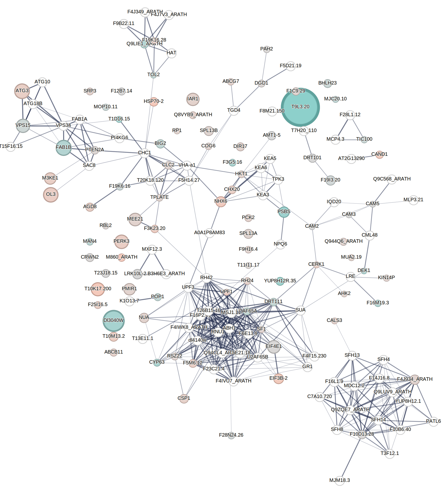

  
# ANALYSIS OF RPHOSPHOPROTEOME AFTER IAA TREATMENT of *CHARA BRAUNII*

## Loading of libraries
```r
require(scales)
```

## Loading of dataset and selection of IAA only (not BA) specific phosphosites

```r
tabl <- read.table("chara_phospho.sort.homo",header=T,sep="\t")
sel <- tabl[(tabl$BA_DMSO.Students.T.test.Significant=="-")&(tabl$IAA_DMSO.Students.T.test.Significant=="+"),]
write.table(sel,file = "chara_phospho.sort.homo.sig_IAA_only",quote = F,sep = "\t",row.names = F)
```

## STRING analysis

The file `chara_phospho.sort.homo.sig_IAA_only` have to be loaded in  and the mapping file have to be downloaded and load in R. The SVG file produced by STRING have to be downloaded and re-saved by Inkscape (it is important, it will change the structure of SVG xml code. 

## Creation of formating file for visualisation of the STRING diagram

```r
mapp <- read.delim("Second_data/analysis/IAA_only-STRING_mapping.tsv")  # There are ' chars in names and annotations!

rate <- NULL
FDR <- NULL
name <- NULL
AGI <- NULL
rng <- round(sum(abs(range(sel$Students.T.test.Difference.IAA_DMSO)))*10)
#rc <- colorRampPalette(colors = c("blue", "grey","red"), space = "rgb")(rng+1)
rc <- colorRampPalette(colors = c("#41B1A9FF", "grey","#EFA68EFF"), space = "rgb")(rng+1)
for(l in 1:nrow(mapp)){
  AGI[l] <- mapp$queryItem[l]
  phi <- which.max(sel$FDR.IAA_DMSO...Log.Students.T.test.p.value.[sel$AGI==AGI[l]])
  rate[l] <- rc[1+round(10*(-min(sel$Students.T.test.Difference.IAA_DMSO) + sel$Students.T.test.Difference.IAA_DMSO[sel$AGI==AGI[l]][phi]))]
  FDR[l] <- 10*sel$FDR.IAA_DMSO...Log.Students.T.test.p.value.[sel$AGI==AGI[l]][phi]
  name[l] <- mapp$preferredName[which(mapp$queryItem == AGI[l])[1]]
}
write.table(cbind(name,AGI,rate,FDR),"IAA_only-STRING.fmt",row.names = F,col.names = F, sep="\t",quote=F)
```

## Creation of a legend for the STRING diagram

```r
library(plotfunctions)
pdf("legend.pdf",width = 6,height = 6)
par(mar=c(1,1,1,1))
emptyPlot(1,1, axes=FALSE)
# legend on outside of plotregion:
gradientLegend(valRange = c(1,rng+1),color = rc,pos = .5,side=2,inside = T,tick.col = NA)
dev.off()
```

## Adaptation of the STRING SVG file

BASH script. The colours and diameters of circles in the STRING diagram will be changed according to the fold change and FDR respectively obtained by prosphoproteomic analysis.

```sh
filename="IAA_only-all"

# Primary editing of SVG
cat ${filename}.svg | tr -d $'\n' | sed -e "s/>/>\n/g" | sed -e "s/font-size: 12px/font-size: 20px/" -e "s/url(#filter_bg_textFlat)/url(#filter_bg_text)/" -e "s/style=\"fill:url(#radialGradient.*\"//" -e "s/opacity: 0.4/opacity: 0.6/" -e "s/'/\"/g" > ${filename}_peach.svg

# Final editing of SVG to change colours and diameters
while read l
do
echo $l
name=`echo $l | cut -f 1 -d " "`
coldef=`echo $l | cut -f 3 -d " "`
raddef=`echo $l | cut -f 4 -d " "`
if [ "$coldef" != "NA" ]
then
sed -i "/data-safe_div_label=\"${name}\"/,/<\/g>/ s/r=\"20\"/r=\"${raddef}\"/g" ${filename}_peach.svg
sed -i "/data-safe_div_label=\"${name}\"/,/${name}<\/text>/ s/nwbubblecoloredcircle\(.*\)fill=\".*\" r=/nwbubblecoloredcircle\1fill=\"${coldef}\" r=/" ${filename}_peach.svg
fi
done < IAA_only-STRING.fmt
```




